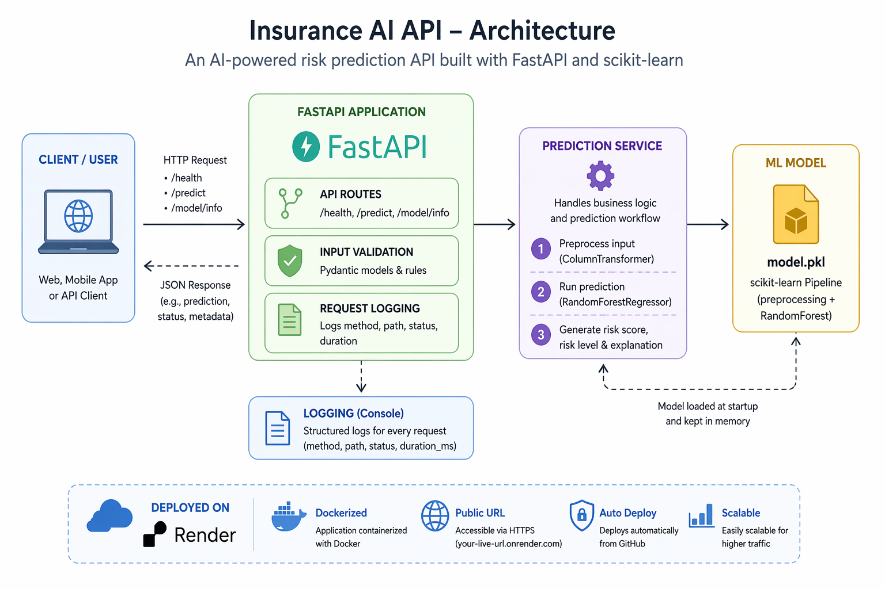

# Insurance AI API

A simple MVP backend for insurance risk prediction built with FastAPI and scikit-learn.

## Project Overview

Insurance AI API is a backend MVP that predicts insurance risk from user profile data using a trained scikit-learn model exposed through a FastAPI service.

## Architecture


### Tech Stack

- FastAPI
- scikit-learn
- pandas
- Docker
- pytest

### Endpoints

- `GET /health` — service health check
- `POST /predict` — generate risk prediction
- `GET /model/info` — view loaded model metadata

### Example Use Case

A client submits insurance-related attributes such as age, BMI, smoking status, region, and number of children.  
The API returns:

- risk score
- risk level
- explanation

### What this project demonstrates

- building and serving an ML model through an API
- separating route logic from service logic
- input validation with Pydantic
- model lifecycle basics
- containerized deployment with Docker
- MVP deployment to production

## Run locally

```bash
pip install -r requirements.txt
uvicorn app.main:app --reload
```

## Run with Docker
```bash
docker build -t insurance-ai-api .
docker run -p 8000:8000 insurance-ai-api
```

## Example prediction request
```bash
curl -X POST "http://127.0.0.1:8000/predict" \
  -H "Content-Type: application/json" \
  -d '{
    "age": 45,
    "bmi": 31.2,
    "smoker": true,
    "region": "southwest",
    "children": 2
  }'
```

## Run tests
```bash
pytest tests/
```